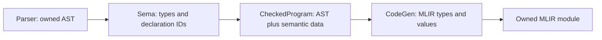

# Checked program and backend contract

SPEC-010 makes semantic checking the owner of core type and declaration resolution.
The normal pipeline is:

`Sema::check_for_codegen(std::move(ast))` returns a `unique_ptr<CheckedProgram>`
only when checking succeeds. It consumes the AST on success and failure.
`CodeGen::generate(const CheckedProgram&)` accepts this object and returns an
`mlir::OwningOpRef<mlir::ModuleOp>`. There is no `generate(raw_ast)` overload, and
clients cannot construct a checked program themselves. Compile-time tests enforce
these API restrictions. `compile_source` uses this path exclusively.

Both APIs default to `CompilationMode::Module`, permitting source without `main`.
Use `compile_source(text, filename, context, CompilationMode::Executable)` or
`sema.check_for_codegen(std::move(ast), {}, CompilationMode::Executable)` when
preparing an executable. Executable mode requires `main() -> i32`; both modes
validate any file-scope `main` that is present. `CheckedProgram::mode()` records
the requested mode and `entry_point()` exposes the validated function's symbol
ID when present. Entry validation does not itself run or lower the module.

## Types and declarations

[numeric.h](../src/numeric.h) defines canonical `CoreType` IDs for
`void`, `bool`, signed/unsigned 8/16/32/64-bit integers, and `f32`/`f64`. The type
descriptor records storage width, integer category, and signedness. `bool` has
its own identity. MLIR stores signed and unsigned language integers in signless
integer types; semantic data preserves the distinction for operator selection.

Sema resolves `int` to `i32` and `usize` to `u64` for the selected 64-bit Apple
Silicon target. Target information belongs to the checked program; a different
pointer width is rejected instead of using the host process's `sizeof(void*)`.
This is not a cross-compilation implementation. Unknown and deferred types,
including `String`, `string`, 128-bit/custom-width/endian types, fail even in
unused parameters, bindings, or return annotations. `void` is restricted to
return annotations.

Semantic data associates AST annotations and value expressions with canonical
types. Declaration names and identifier uses bind to program-local `SymbolId`s.
Symbols retain their kind, value/return type, function parameter types,
mutability, and source span. Nested shadowing creates different IDs; a later
codegen lookup cannot accidentally resolve the same spelling to another binding.
Duplicate declarations in the same scope fail when constructing checked data.

SPEC-011 collects all core function signatures before checking any body, then
codegen declares all corresponding MLIR functions before emitting their bodies.
Direct, forward, and mutually recursive calls therefore use the same resolved
IDs. Function IDs are allocated first in source order; IDs are opaque and local
to one program, not persistent indexes clients should infer from AST traversal.
The predefined core types are available before collection. User-defined type
collection remains deferred with aggregate support; core checking rejects it.

Parameters share the function body's outer scope and are explicitly immutable.
Nested blocks may shadow outer variables, parameters, and functions; duplicate
names within one scope fail. Initializers resolve before their new binding
enters scope. Branches and while bodies keep their own locals, and leaving a
scope restores outer lookup. See the normative
[scope rules](../SPEC.md#declaration-visibility-and-lexical-scopes-spec-011).

Each checked run starts and ends with an empty scope and clears its temporary
function collection. Successful reuse of Sema cannot retain declarations from
an earlier program. Diagnostics are cumulative: after an error, create a fresh
Sema/diagnostics pair; `compile_source` already does so for each invocation.

Codegen maps canonical types to MLIR types and IDs to generated values/functions.
Function signatures, parameter storage, local allocation/load types, references,
and calls use those maps. Checked generation refuses to enter the legacy string
type resolver or name lookup and fails on missing semantic data. It also checks
that emitted value/storage types agree with semantic types. No missing type or
unresolved expression becomes an `i32` fallback on this path.

## Functions and returns

SPEC-014 validates exact call arity and canonical argument/result types before
creating a checked program. Calls resolve a direct function name; function
values and indirect calls are unsupported. Void calls can appear as expression
statements only. Non-void call results can be discarded.

Every non-void function must return a matching value on all structurally reachable
paths. Void functions allow bare returns and fallthrough, which codegen turns
into a zero-result return. Both returning arms of an `if` end the enclosing
path; loops retain a possible zero-iteration path even with a literal `true`
condition. Sema rejects statements after an unconditional return and checks both
branches regardless of constant conditions. These rules reuse definite
initialization's branch reachability without adding constant-condition analysis.
See the normative [function contract](../SPEC.md#functions-calls-returns-and-entry-points-spec-014).

Codegen retains defensive return-signature checks and refuses a checked non-void
function with reachable fallthrough. It no longer substitutes LLVM `unreachable`
for such a missing return. Legacy unchecked stage experiments retain their
existing behavior; they cannot produce a `CheckedProgram`.

## Variables and constants

SPEC-012 checks initializer/store types before codegen and distinguishes reads
from assignment targets. Initialization state is keyed by declaration ID:
uninitialized, initialized, or initialized on only some paths. An `if` merges
only branches that reach its continuation. A `while` includes its zero-iteration
path, and cannot initialize an outer immutable local because it may repeat.
Leaving a lexical scope discards its local initialization state. Parameters start
initialized; a delayed immutable local permits only its first assignment.

Delayed locals use storage with their resolved type. An immutable local with an
initializer can remain an SSA value. These choices do not grant mutability:
semantic checking has already rejected every forbidden store or uninitialized
read. Aggregate addressability and full control-flow validation remain later tasks.

Top-level constants are evaluated in source order after function collection and
before bodies. Local constants obey lexical scope. The frontend evaluator in
[sema_constants.cpp](../src/sema_constants.cpp) type checks pure expressions, then
evaluates them with overflow/zero-divisor checks and boolean short-circuiting.
The checked program owns folded values of every supported scalar type keyed by
constant declaration ID. Integer values use LLVM `APInt` at their resolved width;
floating values use `APFloat` with binary32/binary64 semantics, preserving rounded
values and signed zero. Codegen emits a constant at each use; it emits
no initializer expression or runtime storage for a constant declaration.

Runtime calls and runtime bindings are forbidden in constant expressions.
Forward constant dependencies fail explicitly. SPEC-013 provides contextual
literal typing; SPEC-015 supplies the matching runtime operator rules.
The normative rules are in
[SPEC.md](../SPEC.md#variables-constants-and-initialization-spec-012).

## Numeric values (SPEC-013)

Numeric AST nodes own their spellings, with no host integer/double approximation.
Sema supplies context from declarations, assignment targets, parameters, returns,
and typed arithmetic operands. Typed operands determine the common operand type;
they are never implicitly widened or narrowed. Literal-only arithmetic receives
its enclosing numeric context. Unconstrained integers/floats default to i32/f32.
Integer and floating spellings retain separate categories. The first release
rejects numeric casts and conversions between already typed values.

[numeric.cpp](../src/numeric.cpp) validates complete spellings and ranges before
constructing resolved values. Integer magnitudes cover all of u64. A minus
applied directly to a literal is checked as a signed literal, allowing the signed
minimum without first forcing its positive magnitude into a signed type. The
literal table records that combined expression; its magnitude child is syntax,
not a separately generated positive value.

Decimal floats convert directly to their selected IEEE format using nearest,
ties-to-even rounding. Finite subnormals and inexact rounding are accepted;
overflow and nonzero literals rounding to zero fail. Constant arithmetic uses
APInt overflow checks and APFloat operations at the resolved width, preserving
SPEC-012's arithmetic-error and short-circuit rules.

The checked program owns a separate table of resolved literal values. Codegen
emits these exact APInt/APFloat attributes and never reparses checked source or
converts it through host numeric types. The explicit unchecked backend uses the
same conversion helper with its historical default literal types; it does not
establish contextual typing. The frontend links the already-required shared LLVM
library for these value classes and still has no MLIR dependency.

These rules are normative in
[SPEC.md](../SPEC.md#numeric-literals-and-conversions-spec-013).

## Expression operators

SPEC-015 shares [operators.h](../src/operators.h) between constant and runtime
semantic checking. It defines the accepted operand categories and result types;
binary operands must also have identical canonical types. Unary minus preserves
signed integer/float types, logical operators require bool, and comparisons
produce bool. Unsupported categories/operators and nested assignment expressions
fail before codegen, including through the AST API.

[codegen_operators.cpp](../src/codegen_operators.cpp) selects signed/unsigned
integer operations and native floating operations from semantic types. Integer
addition/subtraction/multiplication use double-width intermediate values and a
truncate/extend comparison to detect overflow. These internal widths do not add
128-bit language types. Division/remainder guard zero divisors and signed
minimum with -1 before executing. Negation checks signed overflow. Floating
operations have no fast-math flags; finite bounds checks reject non-finite
results, and division checks either sign of zero. Subnormals and arithmetic
underflow to signed zero remain valid.

Guards branch to an LLVM trap on failure. Failure is distinct from a program's
i32 result; the external runner reports a failed child process. There is no
in-process recovery API yet. `&&`/`||` use conditional branches and a boolean
merge argument, so skipped operands are not emitted on the executed path.
Operands and call arguments evaluate once, left to right. These expression
continuations also work in existing branch/loop conditions and stores; general
control-flow completion remains SPEC-016/017.

The normative [operator contract](../SPEC.md#expression-operators-and-arithmetic-failure-spec-015)
defines rounding, overflow, division/remainder signs, and unsupported operators.

## Ownership

The checked program owns its AST and semantic tables. AST addresses remain stable
as unique ownership moves; table keys point into that owned tree. Callers must
relinquish mutable aliases when handing their AST to Sema. The public checked
API exposes read-only symbol metadata and counts, not mutable AST nodes/tables.
Tokens, AST nodes, and diagnostics share immutable source storage.

A checked program outlives its synchronous codegen call. It contains no MLIR
objects and can outlive its parser and Sema. Codegen borrows semantic data only
during generation. The returned owned module may outlive both codegen and the
checked program, but its caller-owned MLIR context must outlive the module.
Failed generation destroys its partial module. A CodeGen instance generates one
module; destruction also cleans up a module that was never transferred.

## Explicit stage tests and remaining work

`Sema::check_program` and individual visitor methods remain available for legacy
stage tests; their boolean/type results are not checked-program certificates.
`CodeGen::generate_unchecked_for_testing(raw_ast)` retains the existing deferred
backend experiments and returns a caller-owned raw module. This name makes the
bypass explicit; it is never used by `compile_source`. Tests retain their original
feature assertions and known failures. Synthetic runtime declarations and legacy
aggregate registries are initialized only on this unchecked path.

This contract does not complete semantic checking. The `for` initializer scope
and loop lowering remain SPEC-017. Context-free literal defaults are `i32`/`f32`;
typed contexts select the other supported widths. SPEC-014 establishes return-path
analysis, unreachable-source rejection, and explicit executable entry validation.
General control-flow lowering remains SPEC-016/017.

SPEC-015 implements checked scalar operators, including floating arithmetic and
unsigned division/ordering. Complete verification/lowering and
JIT integration remain SPEC-018/SPEC-019. Aggregate and concurrency contracts stay
deferred. A checked object establishes resolved identities and the checks currently
implemented, not full release readiness.
