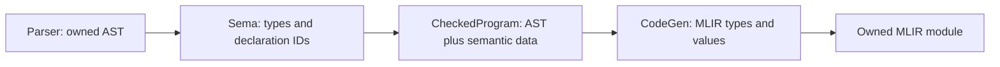

# Checked program and backend contract

SPEC-010 makes semantic checking the owner of core type and declaration resolution.
The normal pipeline is:

`Sema::check_for_codegen(std::move(ast))` returns a `unique_ptr<CheckedProgram>`
only when checking succeeds. It consumes the AST on success and failure.
`CodeGen::generate(const CheckedProgram&)` accepts this object and returns an
`mlir::OwningOpRef<mlir::ModuleOp>`. There is no `generate(raw_ast)` overload, and
clients cannot construct a checked program themselves. Compile-time tests enforce
these API restrictions. `compile_source` uses this path exclusively.

## Types and declarations

[checked_program.h](../src/checked_program.h) defines canonical `CoreType` IDs for
`void`, `bool`, signed/unsigned 8/16/32/64-bit integers, and `f32`/`f64`. The type
descriptor records storage width, integer category, and signedness. `bool` has
its own identity. MLIR stores signed and unsigned language integers in signless
integer types; semantic data preserves the distinction for operator selection.

Sema resolves `int` to `i32` and `usize` to `u64` for the selected 64-bit Apple
Silicon target. Target information belongs to the checked program; a different
pointer width is rejected instead of using the host process's `sizeof(void*)`.
This is not a cross-compilation implementation. Unknown and deferred types,
including `String`, `string`, 128-bit/custom-width/endian types, fail even in
unused parameters, bindings, or return annotations. `void` is restricted to
return annotations.

Semantic data associates AST annotations and value expressions with canonical
types. Declaration names and identifier uses bind to program-local `SymbolId`s.
Symbols retain their kind, value/return type, function parameter types,
mutability, and source span. Nested shadowing creates different IDs; a later
codegen lookup cannot accidentally resolve the same spelling to another binding.
Duplicate declarations in the same scope fail when constructing checked data.

Codegen maps canonical types to MLIR types and IDs to generated values/functions.
Function signatures, parameter storage, local allocation/load types, references,
and calls use those maps. Checked generation refuses to enter the legacy string
type resolver or name lookup and fails on missing semantic data. It also checks
that emitted value/storage types agree with semantic types. No missing type or
unresolved expression becomes an `i32` fallback on this path.

## Ownership

The checked program owns its AST and semantic tables. AST addresses remain stable
as unique ownership moves; table keys point into that owned tree. Callers must
relinquish mutable aliases when handing their AST to Sema. The public checked
API exposes read-only symbol metadata and counts, not mutable AST nodes/tables.
Tokens, AST nodes, and diagnostics share immutable source storage.

A checked program outlives its synchronous codegen call. It contains no MLIR
objects and can outlive its parser and Sema. Codegen borrows semantic data only
during generation. The returned owned module may outlive both codegen and the
checked program, but its caller-owned MLIR context must outlive the module.
Failed generation destroys its partial module. A CodeGen instance generates one
module; destruction also cleans up a module that was never transferred.

## Explicit stage tests and remaining work

`Sema::check_program` and individual visitor methods remain available for legacy
stage tests; their boolean/type results are not checked-program certificates.
`CodeGen::generate_unchecked_for_testing(raw_ast)` retains the existing deferred
backend experiments and returns a caller-owned raw module. This name makes the
bypass explicit; it is never used by `compile_source`. Tests retain their original
feature assertions and known failures. Synthetic runtime declarations and legacy
aggregate registries are initialized only on this unchecked path.

This contract does not complete semantic checking. Function collection and full
scope policy remain SPEC-011: calls still follow the existing declaration order.
Constants and definite initialization remain SPEC-012. Literal defaults remain
`i32`/`f32`; contextual typing, ranges, and conversions remain SPEC-013. Return-path
analysis and entry-point validation remain SPEC-014. Codegen now rejects explicit
return/signature mismatches, but that is not a replacement for return analysis.

Floating arithmetic and unsigned division/ordering are explicitly rejected by
checked codegen until SPEC-015 implements the correct operations; they cannot
accidentally use integer or signed operations. Complete verification/lowering and
JIT integration remain SPEC-018/SPEC-019. Aggregate and concurrency contracts stay
deferred. A checked object establishes resolved identities and the checks currently
implemented, not full release readiness.
