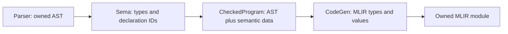

# Checked program and backend contract

SPEC-010 makes semantic checking the owner of core type and declaration resolution.
The normal pipeline is:

`Sema::check_for_codegen(std::move(ast))` returns a `unique_ptr<CheckedProgram>`
only when checking succeeds. It consumes the AST on success and failure.
`CodeGen::generate(const CheckedProgram&)` accepts this object and returns an
`mlir::OwningOpRef<mlir::ModuleOp>`. There is no `generate(raw_ast)` overload, and
clients cannot construct a checked program themselves. Compile-time tests enforce
these API restrictions. `compile_source` uses this path exclusively.

## Types and declarations

[checked_program.h](../src/checked_program.h) defines canonical `CoreType` IDs for
`void`, `bool`, signed/unsigned 8/16/32/64-bit integers, and `f32`/`f64`. The type
descriptor records storage width, integer category, and signedness. `bool` has
its own identity. MLIR stores signed and unsigned language integers in signless
integer types; semantic data preserves the distinction for operator selection.

Sema resolves `int` to `i32` and `usize` to `u64` for the selected 64-bit Apple
Silicon target. Target information belongs to the checked program; a different
pointer width is rejected instead of using the host process's `sizeof(void*)`.
This is not a cross-compilation implementation. Unknown and deferred types,
including `String`, `string`, 128-bit/custom-width/endian types, fail even in
unused parameters, bindings, or return annotations. `void` is restricted to
return annotations.

Semantic data associates AST annotations and value expressions with canonical
types. Declaration names and identifier uses bind to program-local `SymbolId`s.
Symbols retain their kind, value/return type, function parameter types,
mutability, and source span. Nested shadowing creates different IDs; a later
codegen lookup cannot accidentally resolve the same spelling to another binding.
Duplicate declarations in the same scope fail when constructing checked data.

SPEC-011 collects all core function signatures before checking any body, then
codegen declares all corresponding MLIR functions before emitting their bodies.
Direct, forward, and mutually recursive calls therefore use the same resolved
IDs. Function IDs are allocated first in source order; IDs are opaque and local
to one program, not persistent indexes clients should infer from AST traversal.
The predefined core types are available before collection. User-defined type
collection remains deferred with aggregate support; core checking rejects it.

Parameters share the function body's outer scope and are explicitly immutable.
Nested blocks may shadow outer variables, parameters, and functions; duplicate
names within one scope fail. Initializers resolve before their new binding
enters scope. Branches and while bodies keep their own locals, and leaving a
scope restores outer lookup. See the normative
[scope rules](../SPEC.md#declaration-visibility-and-lexical-scopes-spec-011).

Each checked run starts and ends with an empty scope and clears its temporary
function collection. Successful reuse of Sema cannot retain declarations from
an earlier program. Diagnostics are cumulative: after an error, create a fresh
Sema/diagnostics pair; `compile_source` already does so for each invocation.

Codegen maps canonical types to MLIR types and IDs to generated values/functions.
Function signatures, parameter storage, local allocation/load types, references,
and calls use those maps. Checked generation refuses to enter the legacy string
type resolver or name lookup and fails on missing semantic data. It also checks
that emitted value/storage types agree with semantic types. No missing type or
unresolved expression becomes an `i32` fallback on this path.

## Variables and constants

SPEC-012 checks initializer/store types before codegen and distinguishes reads
from assignment targets. Initialization state is keyed by declaration ID:
uninitialized, initialized, or initialized on only some paths. An `if` merges
only branches that reach its continuation. A `while` includes its zero-iteration
path, and cannot initialize an outer immutable local because it may repeat.
Leaving a lexical scope discards its local initialization state. Parameters start
initialized; a delayed immutable local permits only its first assignment.

Delayed locals use storage with their resolved type. An immutable local with an
initializer can remain an SSA value. These choices do not grant mutability:
semantic checking has already rejected every forbidden store or uninitialized
read. Aggregate addressability and full control-flow validation remain later tasks.

Top-level constants are evaluated in source order after function collection and
before bodies. Local constants obey lexical scope. The frontend evaluator in
[sema_constants.cpp](../src/sema_constants.cpp) type checks pure expressions, then
evaluates them with overflow/zero-divisor checks and boolean short-circuiting.
The checked program owns folded values (`i32`, `f32`, or `bool` with current
literal defaults) keyed by constant declaration ID. Floating values retain the
rounded f32 value and signed zero. Codegen emits a constant at each use; it emits
no initializer expression or runtime storage for a constant declaration.

Runtime calls and runtime bindings are forbidden in constant expressions.
Forward constant dependencies fail explicitly. Contextual literal types and
conversions remain SPEC-013; complete runtime operator behavior remains SPEC-015.
The normative rules are in
[SPEC.md](../SPEC.md#variables-constants-and-initialization-spec-012).

## Ownership

The checked program owns its AST and semantic tables. AST addresses remain stable
as unique ownership moves; table keys point into that owned tree. Callers must
relinquish mutable aliases when handing their AST to Sema. The public checked
API exposes read-only symbol metadata and counts, not mutable AST nodes/tables.
Tokens, AST nodes, and diagnostics share immutable source storage.

A checked program outlives its synchronous codegen call. It contains no MLIR
objects and can outlive its parser and Sema. Codegen borrows semantic data only
during generation. The returned owned module may outlive both codegen and the
checked program, but its caller-owned MLIR context must outlive the module.
Failed generation destroys its partial module. A CodeGen instance generates one
module; destruction also cleans up a module that was never transferred.

## Explicit stage tests and remaining work

`Sema::check_program` and individual visitor methods remain available for legacy
stage tests; their boolean/type results are not checked-program certificates.
`CodeGen::generate_unchecked_for_testing(raw_ast)` retains the existing deferred
backend experiments and returns a caller-owned raw module. This name makes the
bypass explicit; it is never used by `compile_source`. Tests retain their original
feature assertions and known failures. Synthetic runtime declarations and legacy
aggregate registries are initialized only on this unchecked path.

This contract does not complete semantic checking. The `for` initializer scope
and loop lowering remain SPEC-017. Literal defaults remain
`i32`/`f32`; contextual typing, ranges, and conversions remain SPEC-013. Return-path
analysis and entry-point validation remain SPEC-014. Codegen now rejects explicit
return/signature mismatches, but that is not a replacement for return analysis.

Runtime floating arithmetic and unsigned division/ordering are explicitly rejected by
checked codegen until SPEC-015 implements the correct operations; they cannot
accidentally use integer or signed operations. Complete verification/lowering and
JIT integration remain SPEC-018/SPEC-019. Aggregate and concurrency contracts stay
deferred. A checked object establishes resolved identities and the checks currently
implemented, not full release readiness.
