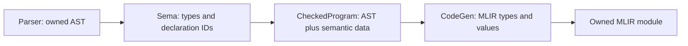

# Checked program and backend contract

SPEC-010 makes semantic checking the owner of core type and declaration resolution.
The normal pipeline is:

`Sema::check_for_codegen(std::move(ast))` returns a `unique_ptr<CheckedProgram>`
only when checking succeeds. It consumes the AST on success and failure.
`CodeGen::generate(const CheckedProgram&)` accepts this object and returns an
`mlir::OwningOpRef<mlir::ModuleOp>`. There is no `generate(raw_ast)` overload, and
clients cannot construct a checked program themselves. Compile-time tests enforce
these API restrictions. `compile_source` uses this path exclusively.

Both APIs default to `CompilationMode::Module`, permitting source without `main`.
Use `compile_source(text, filename, context, CompilationMode::Executable)` or
`sema.check_for_codegen(std::move(ast), {}, CompilationMode::Executable)` when
preparing an executable. Executable mode requires `main() -> i32`; both modes
validate any file-scope `main` that is present. `CheckedProgram::mode()` records
the requested mode and `entry_point()` exposes the validated function's symbol
ID when present. Entry validation does not itself run or lower the module.

## Types and declarations

[numeric.h](../src/numeric.h) defines canonical `CoreType` IDs for
`void`, `bool`, signed/unsigned 8/16/32/64-bit integers, `f32`/`f64`, and `string`. The type
descriptor records storage width, integer category, and signedness. `bool` has
its own identity. MLIR stores signed and unsigned language integers in signless
integer types; semantic data preserves the distinction for operator selection.

Sema resolves `int` to `i32` and `usize` to `u64` for the selected 64-bit Apple
Silicon target. Target information belongs to the checked program; a different
pointer width is rejected instead of using the host process's `sizeof(void*)`.
This is not a cross-compilation implementation. Unknown and deferred types,
including undeclared names and 128-bit/custom-width/endian types, fail even in
unused parameters, bindings, or return annotations. `void` is restricted to
return annotations.

Semantic data associates AST annotations and value expressions with canonical
types. Declaration names and identifier uses bind to program-local `SymbolId`s.
Symbols retain their kind, value/return type, function parameter types,
mutability, and source span. Nested shadowing creates different IDs; a later
codegen lookup cannot accidentally resolve the same spelling to another binding.
Duplicate declarations in the same scope fail when constructing checked data.

SPEC-011 collects all core function signatures before checking any body, then
codegen declares all corresponding MLIR functions before emitting their bodies.
Direct, forward, and mutually recursive calls therefore use the same resolved
IDs. Function IDs are allocated first in source order; IDs are opaque and local
to one program, not persistent indexes clients should infer from AST traversal.
The predefined core types are available before collection. SPEC-024 collects
ordinary structs before signatures and rejects by-value layout cycles. `ValueType`
represents a builtin identity or a program-local nominal struct ID, plus any
pointer/reference layers preserving nullability and pointee read-only access. Checked struct
tables retain ordered fields, their types, visibility, and mutability. Literal
field mappings and member indices are resolved once in Sema; codegen consumes
those indices rather than performing field-name lookup. Backend literal LLVM
struct types avoid named-type state leaking between compilations in one context.

Parameters share the function body's outer scope and are explicitly immutable.
Nested blocks may shadow outer variables, parameters, and functions; duplicate
names within one scope fail. Initializers resolve before their new binding
enters scope. Branches and while bodies keep their own locals, and leaving a
scope restores outer lookup. See the normative
[scope rules](../SPEC.md#declaration-visibility-and-lexical-scopes-spec-011).

Each checked run starts and ends with an empty scope and clears its temporary
function collection. Successful reuse of Sema cannot retain declarations from
an earlier program. Diagnostics are cumulative: after an error, create a fresh
Sema/diagnostics pair; `compile_source` already does so for each invocation.

Codegen maps canonical types to MLIR types and IDs to generated values/functions.
Function signatures, parameter storage, local allocation/load types, references,
and calls use those maps. Checked generation refuses to enter the legacy string
type resolver or name lookup and fails on missing semantic data. It also checks
that emitted value/storage types agree with semantic types. No missing type or
unresolved expression becomes an `i32` fallback on this path.

## Functions and returns

SPEC-014 validates exact call arity and canonical argument/result types before
creating a checked program. Calls resolve a direct function name; function
values and indirect calls are unsupported. Void calls can appear as expression
statements only. Non-void call results can be discarded.

Every non-void function must return a matching value on all structurally reachable
paths. Void functions allow bare returns and fallthrough, which codegen turns
into a zero-result return. Both returning arms of an `if` end the enclosing
path; loops retain a possible zero-iteration path even with a literal `true`
condition. Sema rejects statements after an unconditional return and checks both
branches regardless of constant conditions. These rules reuse definite
initialization's branch reachability without adding constant-condition analysis.
See the normative [function contract](../SPEC.md#functions-calls-returns-and-entry-points-spec-014).

Codegen retains defensive return-signature checks and refuses a checked non-void
function with reachable fallthrough. It no longer substitutes LLVM `unreachable`
for such a missing return. Legacy unchecked stage experiments retain their
existing behavior; they cannot produce a `CheckedProgram`.

## Variables and constants

SPEC-012 checks initializer/store types before codegen and distinguishes reads
from assignment targets. Initialization state is keyed by declaration ID:
uninitialized, initialized, or initialized on only some paths. An `if` merges
only branches that reach its continuation. A `while` includes its zero-iteration
path, and cannot initialize an outer immutable local because it may repeat.
Leaving a lexical scope discards its local initialization state. Parameters start
initialized; a delayed immutable local permits only its first assignment.

Delayed locals use storage with their resolved type. An immutable local with an
initializer can remain an SSA value. These choices do not grant mutability:
semantic checking has already rejected every forbidden store or uninitialized
read. Aggregate addressability remains deferred; SPEC-017 defines `for` scope below.

Top-level constants are evaluated in source order after function collection and
before bodies. Local constants obey lexical scope. The frontend evaluator in
[sema_constants.cpp](../src/sema_constants.cpp) type checks pure expressions, then
evaluates them with overflow/zero-divisor checks and boolean short-circuiting.
The checked program owns folded values of every supported scalar type keyed by
constant declaration ID. Integer values use LLVM `APInt` at their resolved width;
floating values use `APFloat` with binary32/binary64 semantics, preserving rounded
values and signed zero. Codegen emits a constant at each use; it emits
no initializer expression or runtime storage for a constant declaration.

Runtime calls and runtime bindings are forbidden in constant expressions.
Forward constant dependencies fail explicitly. SPEC-013 provides contextual
literal typing; SPEC-015 supplies the matching runtime operator rules.
The normative rules are in
[SPEC.md](../SPEC.md#variables-constants-and-initialization-spec-012).

## Numeric values (SPEC-013)

Numeric AST nodes own their spellings, with no host integer/double approximation.
Sema supplies context from declarations, assignment targets, parameters, returns,
and typed arithmetic operands. Typed operands determine the common operand type;
they are never implicitly widened or narrowed. Literal-only arithmetic receives
its enclosing numeric context. Unconstrained integers/floats default to i32/f32.
Integer and floating spellings retain separate categories. The first release
rejects numeric casts and conversions between already typed values.

[numeric.cpp](../src/numeric.cpp) validates complete spellings and ranges before
constructing resolved values. Integer magnitudes cover all of u64. A minus
applied directly to a literal is checked as a signed literal, allowing the signed
minimum without first forcing its positive magnitude into a signed type. The
literal table records that combined expression; its magnitude child is syntax,
not a separately generated positive value.

Decimal floats convert directly to their selected IEEE format using nearest,
ties-to-even rounding. Finite subnormals and inexact rounding are accepted;
overflow and nonzero literals rounding to zero fail. Constant arithmetic uses
APInt overflow checks and APFloat operations at the resolved width, preserving
SPEC-012's arithmetic-error and short-circuit rules.

The checked program owns a separate table of resolved literal values. Codegen
emits these exact APInt/APFloat attributes and never reparses checked source or
converts it through host numeric types. The explicit unchecked backend uses the
same conversion helper with its historical default literal types; it does not
establish contextual typing. The frontend links the already-required shared LLVM
library for these value classes and still has no MLIR dependency.

These rules are normative in
[SPEC.md](../SPEC.md#numeric-literals-and-conversions-spec-013).

## Expression operators

SPEC-015 shares [operators.h](../src/operators.h) between constant and runtime
semantic checking. It defines the accepted operand categories and result types;
binary operands must also have identical canonical types. Unary minus preserves
signed integer/float types, logical operators require bool, and comparisons
produce bool. Unsupported categories/operators and nested assignment expressions
fail before codegen, including through the AST API.

[codegen_operators.cpp](../src/codegen_operators.cpp) selects signed/unsigned
integer operations and native floating operations from semantic types. Integer
addition/subtraction/multiplication use double-width intermediate values and a
truncate/extend comparison to detect overflow. These internal widths do not add
128-bit language types. Division/remainder guard zero divisors and signed
minimum with -1 before executing. Negation checks signed overflow. Floating
operations have no fast-math flags; finite bounds checks reject non-finite
results, and division checks either sign of zero. Subnormals and arithmetic
underflow to signed zero remain valid.

Guards branch to an LLVM trap on failure. Failure is distinct from a program's
i32 result; the external runner reports a failed child process. There is no
in-process recovery API; SPEC-019 keeps traps process-terminating. `&&`/`||` use conditional branches and a boolean
merge argument, so skipped operands are not emitted on the executed path.
Operands and call arguments evaluate once, left to right. These expression
continuations also work in branch/loop conditions and stores. SPEC-016 supplies
the enclosing statement continuations; SPEC-017 extends them to `unless`/`for`.

The normative [operator contract](../SPEC.md#expression-operators-and-arithmetic-failure-spec-015)
defines rounding, overflow, division/remainder signs, and unsupported operators.

## Branch and loop continuations

SPEC-016 gives codegen an explicit continuation contract. An active builder
insertion point identifies a block that can accept operations; a cleared point
means the current source path has ended. Returns clear the point immediately.
Statement/expression visitors refuse to emit without a live continuation, and
an active point on an already terminated block is an internal generation error.
This also prevents raw stage tests from silently generating statements after
returns; normal compilation already rejects such source in Sema.

[codegen_control_flow.cpp](../src/codegen_control_flow.cpp) emits `if` edges from
the final block of condition evaluation, then connects only continuing arms to
the merge. If neither arm continues, it removes the unused merge and propagates
the terminated state. A missing `else` sends the false edge directly to the merge.
`while` repeats the original condition header from the body's final continuation;
a returning body emits no backedge. Both constructs therefore compose with nested
statements and SPEC-015's expression branches and arithmetic guards.

Function finalization adds an implicit void return only when a live continuation
remains. It no longer infers source reachability from an empty block or its
predecessor count. The existing checked non-void fallthrough guard is retained.
Conditions are boolean in both Sema and codegen. Tests verify every generated
block has one final terminator, successors stay within their function, and no
orphan continuation survives, then execute the module through external tools.
The normative [branch/loop rules](../SPEC.md#branches-and-while-loops-spec-016)
retain SPEC-014's conservative return analysis and unreachable-source rejection.

## Unless and for scope and continuations

SPEC-017 shares conditional checking and lowering between `if` and `unless`.
`unless` reverses the branch destinations and evaluates the boolean condition
once. Its skipped-body path participates in initialization and return analysis.

A `for` introduces a header scope, with a nested scope for its body. Initializers
resolve outer names before adding their binding. The binding is visible in the
condition, body, and update, and disappears after the loop; body-local names
cannot leak into the update. Initializer stores are definite. Body/update stores
merge with a conservative zero-iteration path, even for an omitted condition.
The update reads initialization from continuing body paths; if all paths return,
it is still checked using the pre-body state. Repeated writes to immutable header
or outer locals fail. These checks live in
[sema_control_flow.cpp](../src/sema_control_flow.cpp).

Codegen executes the initializer once, branches to the condition, and emits an
update/backedge only from a continuing body path. Missing conditions emit `true`;
missing initializers/updates emit no operations. Expression guards and boolean
short-circuiting retain their final continuation throughout the header. Returning
paths skip the update and further condition checks. SPEC-027 registers defers
only on reached paths and drains them on function return, not iteration exit.

## Ownership

The checked program owns its AST and semantic tables. AST addresses remain stable
as unique ownership moves; table keys point into that owned tree. Callers must
relinquish mutable aliases when handing their AST to Sema. The public checked
API exposes read-only symbol metadata and counts, not mutable AST nodes/tables.
Tokens, AST nodes, and diagnostics share immutable source storage.

A checked program outlives its synchronous codegen call. It contains no MLIR
objects and can outlive its parser and Sema. Codegen borrows semantic data only
during generation. The returned owned module may outlive both codegen and the
checked program, but its caller-owned MLIR context must outlive the module.
`compile_source` verifies generated IR before returning it and optionally consumes
it through shared LLVM lowering. Consumers that retain high-level IR lower an
owned clone; every failure destroys partial output.
Failed generation destroys its partial module. A CodeGen instance generates one
module; destruction also cleans up a module that was never transferred.

## Explicit stage tests and remaining work

`Sema::check_program` and individual visitor methods remain available for legacy
stage tests; their boolean/type results are not checked-program certificates.
`CodeGen::generate_unchecked_for_testing(raw_ast)` retains the existing deferred
backend experiments and returns a caller-owned raw module. This name makes the
bypass explicit; it is never used by `compile_source`. Tests retain their original
feature assertions and known failures. Synthetic runtime declarations and legacy
aggregate registries are initialized only on this unchecked path.

This contract does not complete semantic checking. Context-free literal defaults are `i32`/`f32`;
typed contexts select the other supported widths. SPEC-014 establishes return-path
analysis, unreachable-source rejection, and explicit executable entry validation.
`if`/`while` lowering is verified under SPEC-016 and `unless`/`for` under SPEC-017.

SPEC-015 implements checked scalar operators, including floating arithmetic and
unsigned division/ordering. SPEC-018 verifies source-generated IR and supplies
[one LLVM lowering pipeline](lowering.md), with explicit module ownership and
operation/type legality checks. SPEC-019 adds [validated in-process execution](jit.md)
with separate results/errors and owned engine lifetimes. Packed aggregates and concurrency stay
deferred. A checked object establishes resolved identities and the checks currently
implemented, not full release readiness.

SPEC-023 loads standard module files before semantic checking. Each import owns
its parsed declarations and source spans. Sema collects module functions, structs, and
constants in a separate scope, resolves public qualified calls to ordinary
`SymbolId`s, and records collision-free emitted names in `SemanticData`.
Codegen declares and compiles those function bodies through the same path as
application functions. Only library calls to `__write_stdout` receive a separate
runtime-call marker; `print` and `println` have no special compiler handling.
Local/package imports and dependencies between standard files remain deferred.

## Ordinary struct layout

Generated modules carry the native LLVM target triple and data layout.
[target_layout.cpp](../src/target_layout.cpp) translates storage types to LLVM
and queries allocation size, ABI alignment, and field offsets, including padding.
The legacy allocation-size helper uses the same calculation. Struct literals
require all fields and preserve source evaluation order; member writes use checked
GEP indices. The [SPEC-024 contract](../SPEC.md#ordinary-structs-spec-024) defines
mutability, privacy, and whole-value initialization requirements.

## Pointers and references (SPEC-025)

`ValueType` retains every pointer layer and the ultimate scalar/nominal pointee.
Only outermost capability weakening is allowed; Sema records the converted type
at value boundaries. Numeric operators retain builtin IDs; pointer comparisons
use LLVM address comparison. Nullable accesses branch to a trap before a load,
store, or reference creation. GEPs and loads use the checked pointee type.

Address-taking records declaration IDs so even immutable locals and value
parameters receive stable entry-block stack slots when necessary. Struct fields
retain their checked indices through pointer access. Pointer edges break layout
cycles; temporary semantic type graphs are released after checking.

Gloin has manually managed lifetimes and no borrow checker. References must
identify live resources, but lifetime/provenance tracking, escape analysis, and
ownership enforcement are not performed. Aliases are permitted. See the
[normative rules](../SPEC.md#pointers-t-vs-t) for conversions and responsibilities.

## Methods (SPEC-026)

Sema collects each struct's method signatures in an isolated member namespace,
then checks their bodies as ordinary functions. A single explicit typed `self`
parameter determines receiver capability. Static methods have no receiver.
Call metadata binds the selected method's symbol ID and records whether the
receiver supplies a struct address or a pointer value. Codegen evaluates that
receiver once before the explicit arguments, then uses ordinary call lowering.
Internal names include the nominal struct ID, keeping source functions and
same-named methods in different types/modules independent.

Read-only locals/parameters used as struct receivers receive entry-block storage
through the existing address-taking mechanism. Temporary struct receivers are
rejected; pointer results of calls remain usable as receivers under manual
lifetime rules. A nullable receiver can be passed to a nullable `self`; null
traps occur on actual access, not on the function call. Both bodies and calls
enforce field mutability and file/module privacy. The old unchecked method
backend is rejected explicitly instead of generating duplicate self parameters.

## Function-exit defer (SPEC-027)

Sema validates a defer operand as an ordinary checked call and records each
function's registration sites. Calls are checked at the registration point,
including definite initialization and receiver capability. No deferred assignment
is treated as immediate initialization. Non-void results may be discarded.

[codegen_defer.cpp](../src/codegen_defer.cpp) shares argument evaluation and call
emission with ordinary calls. A function with defer has one entry-block head
slot. Every reached site captures the receiver/arguments immediately, allocates
a typed native-layout record with `malloc`, writes its previous-link and site
ID, stores the captured values, then pushes it onto that invocation's log.
Allocation failure traps before linking. Each repeated loop registration gets a
separate record; there is no dynamic stack growth.

Normal returns evaluate their result first, then drain the log. The generated
cleanup loop pops a record, loads its captures, frees it, invokes the selected
callee, and repeats. Each record is released before entering user cleanup code.
Implicit void returns use the same path. No cleanup is emitted on arithmetic or
null trap paths. Functions without defer introduce neither a head slot nor
allocator dependencies. This uses the exact native `malloc(i64) -> ptr` and
`free(ptr) -> void` ABIs; source functions with those names are independently
mangled. Both the JIT and external LLVM runner execute the emitted code.

Value captures outlive lexical source bindings; pointer captures do not retain
resources or extend their lifetime. Function-scope storage stays live through
cleanup. Scope/iteration-local pointer escapes remain the programmer's
responsibility under manual lifetimes. No borrow checker or arena API is added.
